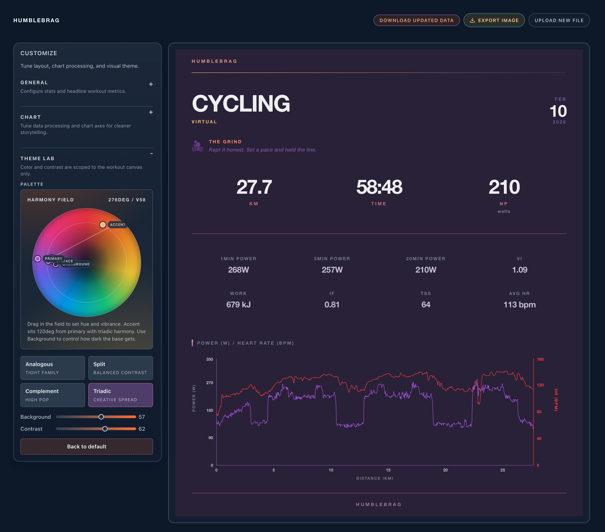

# Humblebrag

Generate beautiful social media graphics from your fitness data.



## What It Does

Upload a FIT file from your cycling or running workout and get a shareable infographic with your key stats, chart, and performance metrics.

## Current Features

- Upload and parse FIT files from cycling and running activities
- Smart chart rendering for power (cycling) or pace (running)
- Basic and advanced stats modes (NP, VI, IF, TSS, best 1/5/20 min power)
- Workout classification with sport-aware labels and descriptions
- Theme Lab customizer (hue, vibrance, depth, contrast, harmony)
- Chart controls (time/distance axis, interval markers, line thickness)
- Data cleanup tools (trim start/end, smoothing, remove zero power/HR)
- Optional adjusted CSV export when cleanup settings are applied
- High-quality PNG export with in-app preview
- Persisted customization settings via localStorage

## Supported Activities

- Cycling (indoor/outdoor)
- Running

## Tech Stack

- React 19 + TypeScript
- Vite (with Rolldown)
- Recharts for visualization
- html-to-image for export
- fit-file-parser for FIT file parsing
- oxlint + oxfmt for fast linting & formatting

## Development

```bash
npm install
npm run dev
```

Build for production:

```bash
npm run build
```

Lint:

```bash
npm run lint
```

Format code:

```bash
npm run format
```

## Usage

1. Click upload or drag-drop a .FIT file
2. Tune card settings in the sidebar (stats mode, chart, cleanup, theme)
3. Review workout stats and chart in the card preview
4. Click "Export Image" to render and download a share-ready PNG
5. Optional: Click "Download Updated Data" to export cleaned/trimmed workout CSV

## Getting FIT Files

FIT files can be exported from:

- Garmin Connect
- Strava (export original file)
- Wahoo apps
- Zwift
- Most cycling computers and fitness trackers
